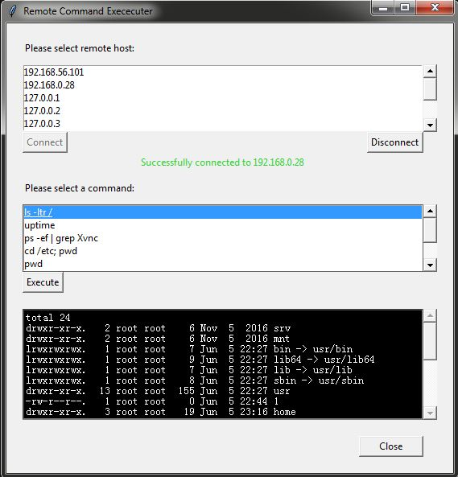

## Description:

A lot of times system administrators need to get quick information about remote servers. It is a burden to login to each server one by one just to run a simple command. 

This project, through a uer-friendly graphical interface, can be used to quickly connect to remote hosts using SSH protocol. When a connection is established, user can select a command to execute on the remote host. The result (or errors) of execution is then shown to the user. Both remote hosts and the commands are configurable in the configuration file.

<br />

## Prerequisite:

Python version 3.3+

Python package: paramiko, tkinter

<br />

## Configuration:
Edit config.ini file to set CONNECTION_LIST for minimum configuration.

<br /> 

## Run:

Clone repository:

https://github.com/omnihenry/python.git

Navigate to ssh_console/

Run 
```
python main.py
```

(or python3 main.py)

<br />

## License:

This project is under MIT License.

<br />

## Screenshot
</img>
